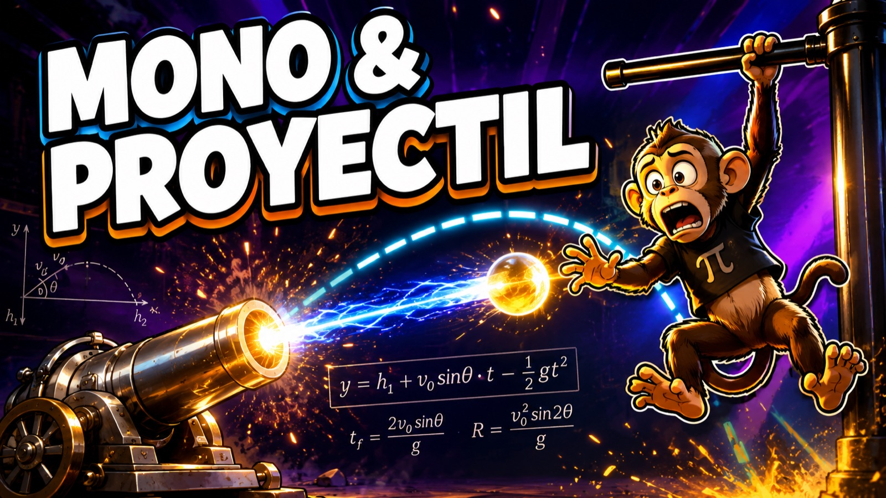
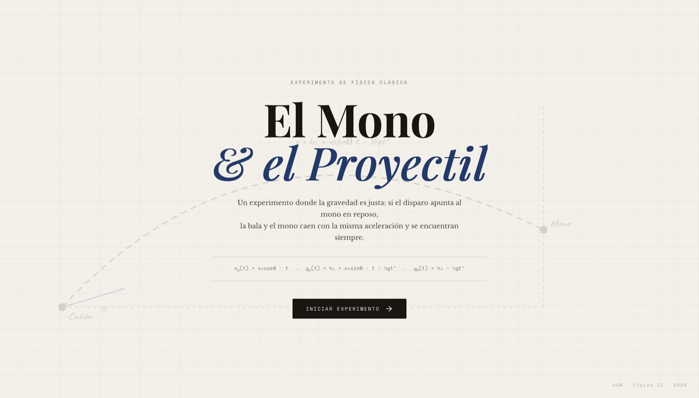
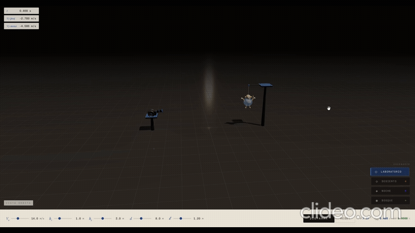
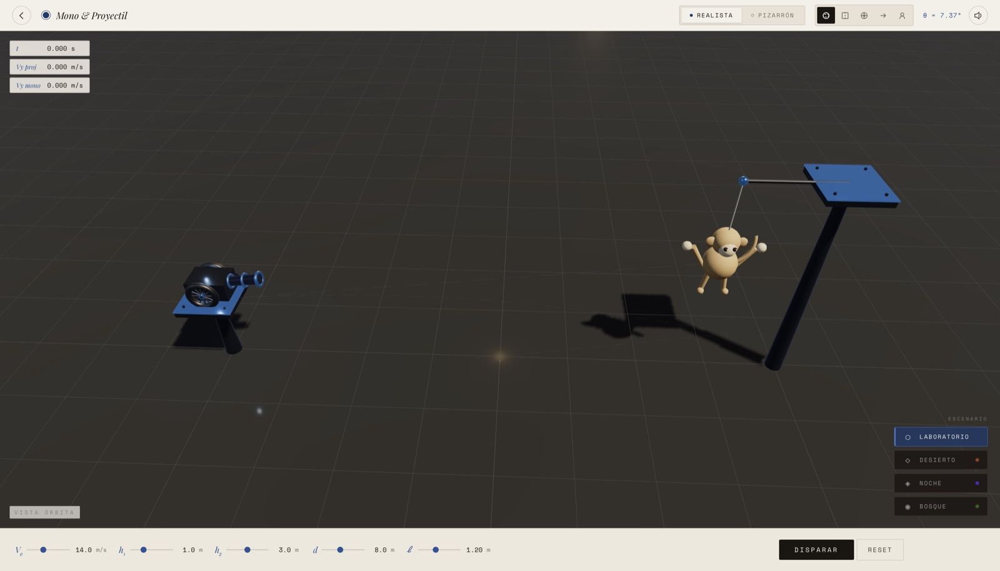
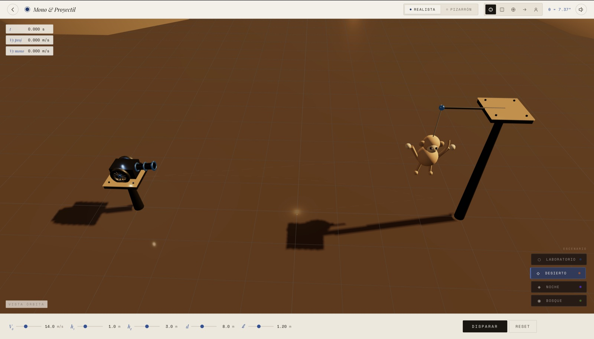
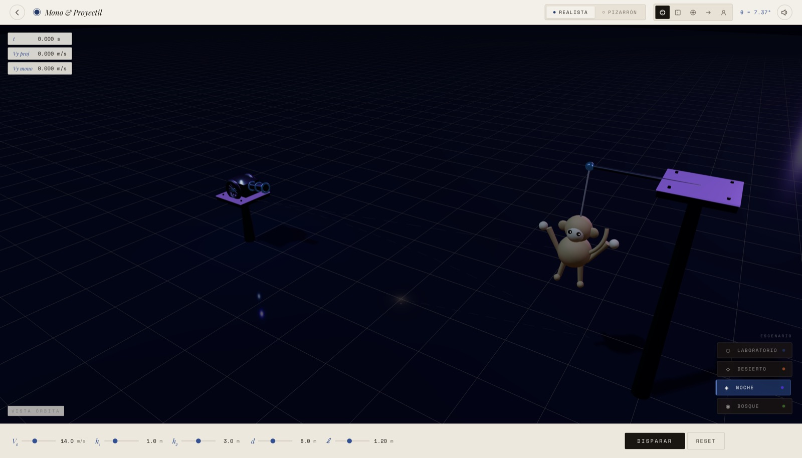
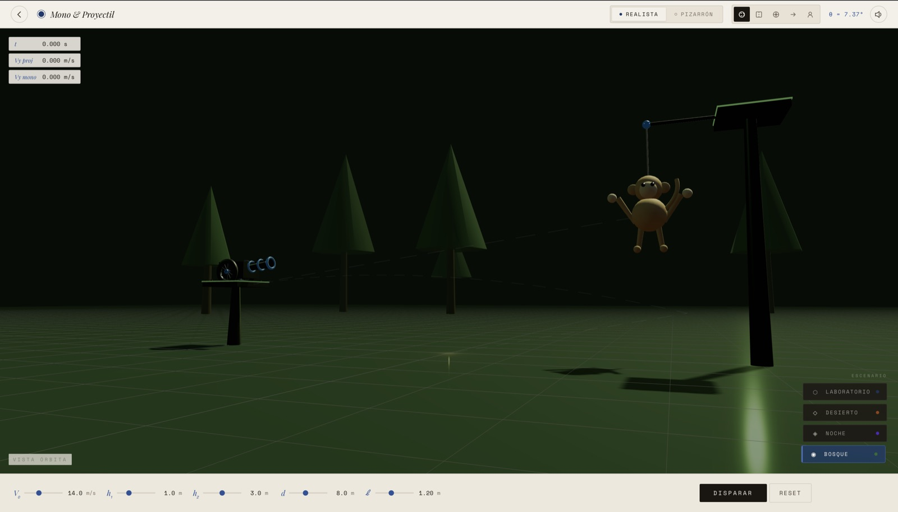
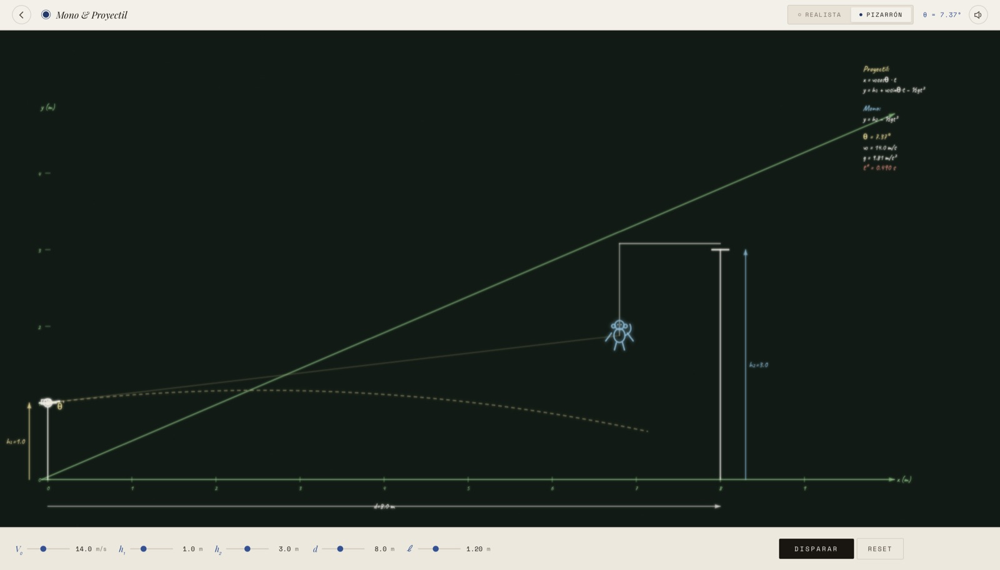
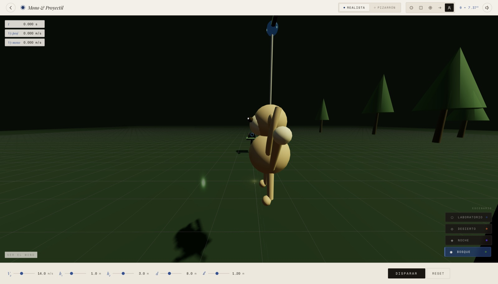
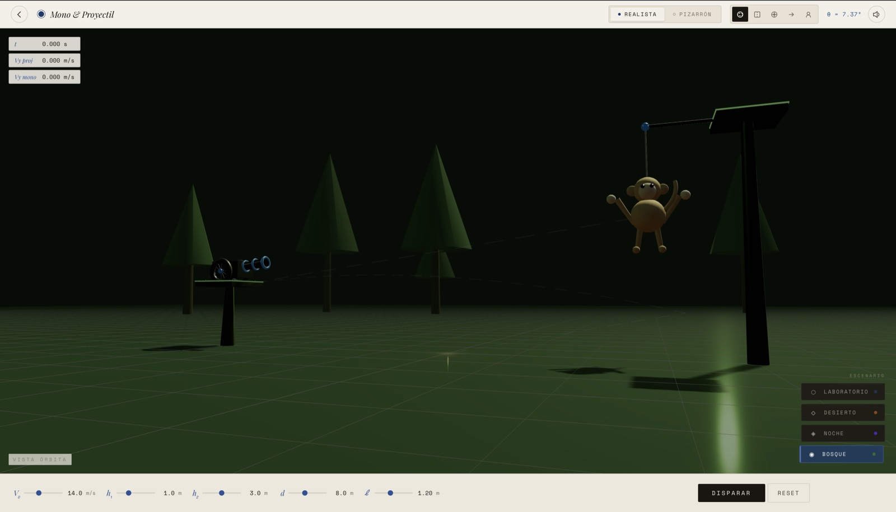

# physics2cinematic

<p align="center">
  
</p>

<p align="center">
  <a href="https://physicsmonkeyproject.netlify.app"><strong>🔴 Live demo — physicsmonkeyproject.netlify.app</strong></a>
</p>

<p align="center">
  
  
  
  
  
</p>

<p align="center">
  <b>English</b> · <a href="#español">Español</a>
</p>

---

> An interactive 3D simulation of the **monkey and hunter** experiment — classical kinematics rendered in real time, with 4 environments, 5 cameras and every sound synthesized from scratch.

No install, no build step. Open the link and it runs, phone included.

## The experiment

If the cannon is aimed directly at the monkey at the moment of the shot, the projectile and the monkey fall with the same acceleration `g = 9.81 m/s²` and they always meet — regardless of `v₀` or `d`.

```
x_p(t) = v₀cosθ · t          y_p(t) = h₁ + v₀sinθ·t − ½gt²
x_m(t) = d − ℓ               y_m(t) = h₂ − ½gt²
```

---

## Overview

### Welcome screen

<p align="center">
  
</p>

### Projectile hitting the monkey

<p align="center">
  
</p>

---

## Environments

<table>
  <tr>
    <td align="center"><b>Laboratory</b></td>
    <td align="center"><b>Desert</b></td>
  </tr>
  <tr>
    <td></td>
    <td></td>
  </tr>
  <tr>
    <td align="center"><b>Night</b></td>
    <td align="center"><b>Forest</b></td>
  </tr>
  <tr>
    <td></td>
    <td></td>
  </tr>
</table>

---

## Blackboard mode

<p align="center">
  
</p>

The same run rendered as chalk-style 2D, with the kinematic equations and live velocity vectors — so the visual and the math sit side by side.

---

## Camera perspectives

<table>
  <tr>
    <td></td>
    <td></td>
  </tr>
</table>

---

## Features

**Physics**
- **Swept-sphere CCD** collision detection — no tunneling at any velocity
- **240 Hz** physics loop with a fixed-timestep accumulator, decoupled from the render framerate
- Monkey position at `x = d − ℓ` — consistent between the physics model and the Three.js scene

**Realistic mode**
- Full PBR: `ACESFilmicToneMapping`, `PCFSoftShadowMap` 2048², `physicallyCorrectLights`
- Runtime IBL via `PMREMGenerator` — metal reflections change per environment
- **5 cameras**: free orbit · side view · cannon POV · bullet cam · monkey POV
- Hand-rolled orbit controller: drag to orbit, right-click to pan, scroll to zoom, touch pinch, inertia
- Vertex-colored trail (blue → black fade), 14 3D fragments with bounce physics, additive particles

**Environments**

| Environment | Description |
|-------------|-------------|
| **Laboratory** | Dark industrial, warm key light, partially mirrored floor |
| **Desert** | Dunes on the horizon, low orange-red sun, warm fog |
| **Night** | 800 stars as `Points`, violet neon lights, dense fog |
| **Forest** | 8 trees, filtered green-yellow sunlight, organic ground |

**Blackboard mode**
2D canvas with a chalk aesthetic: a double-pass `chalkLine()` with blur shadow, formulas in the `Caveat` typeface, real-time velocity vectors, and the monkey drawn as a chalk figure.

**Procedural audio (pure Web Audio API — zero audio assets shipped)**

| Event | Synthesis |
|-------|-----------|
| **Shot** | 55 Hz→18 Hz sub-boom + filtered noise + >3.5 kHz crack + pressure wave + metallic ring |
| **Flight** | FM synthesis: carrier + 220 Hz modulator, 380 Hz depth. Per-frame Doppler. |
| **Impact** | 90 Hz→22 Hz thud + crack + 5 staggered micro-clicks + 3 metallic bounces + reverb |

Master `DynamicsCompressor` + a `ConvolverNode` fed by a 1.8 s synthetic room impulse generated procedurally.

---

## Stack

```
Three.js r128  ·  GSAP 3.12  ·  Web Audio API  ·  Vanilla JS ESM  ·  CSS custom properties
```

## Running locally

```bash
git clone https://github.com/kisnner26/physics2cinematic.git
cd physics2cinematic
python3 -m http.server 8080
```

Open `http://localhost:8080` — an HTTP server is required because the project uses ES modules.

## Structure

```
├── index.html
├── css/
│   ├── theme.css           # design tokens
│   ├── layout.css          # header, stage, environments
│   ├── controls.css        # sliders, buttons
│   └── scene.css           # HUD, overlays
└── js/
    ├── main.js             # main loop, physics, impact
    ├── physics.js          # kinematics + swept sphere
    ├── realistic-scene.js  # Three.js, cameras, environments, fragments
    ├── physics-scene.js    # 2D canvas blackboard
    ├── audio.js            # Web Audio API synthesis
    ├── controls.js         # sliders, modes, cameras, environments
    ├── animations.js       # GSAP sequences
    ├── hud.js              # real-time UI
    └── state.js            # global state
```

## License

MIT — see [LICENSE](LICENSE). Free to use in any classroom, fork, or derivative work.

---

<a name="español"></a>

# Español

> Simulación interactiva 3D del experimento **Mono y Proyectil** — cinemática clásica visualizada con motor de renderizado en tiempo real, 4 escenarios, 5 cámaras y audio procedural sintetizado desde cero.

Sin instalación y sin build: abrís el enlace y corre, incluso en el teléfono.

## El experimento

Si el cañón apunta directamente al mono en el momento del disparo, la bala y el mono caen con la misma aceleración `g = 9.81 m/s²` y siempre se encuentran — sin importar `v₀` o `d`.

## Características

**Física**
- Detección de colisión **Swept Sphere CCD** — sin tunneling a cualquier velocidad
- Loop de física a **240 Hz** con acumulador de tiempo fijo desacoplado del framerate
- Posición del mono en `x = d − ℓ` — consistente entre física y Three.js

**Modo Realista**
- PBR completo: `ACESFilmicToneMapping`, `PCFSoftShadowMap` 2048², `physicallyCorrectLights`
- IBL generado en runtime con `PMREMGenerator` — los reflejos del metal cambian por escenario
- **5 cámaras**: órbita libre · lateral · POV cañón · cámara bala · POV mono
- OrbitControls propio: drag = orbitar, clic derecho = pan, scroll = zoom, touch pinch, inercia
- Trail con vertex colors (fade azul → negro), 14 fragmentos 3D con física de rebote, partículas aditivas

**4 escenarios**

| Escenario | Descripción |
|-----------|-------------|
| **Laboratorio** | Industrial oscuro, luz cálida, suelo con espejo parcial |
| **Desierto** | Dunas al fondo, sol naranja-rojizo bajo, niebla cálida |
| **Noche** | 800 estrellas como `Points`, luces de neón violeta, fog denso |
| **Bosque** | 8 árboles, luz solar verde-amarilla filtrada, suelo orgánico |

**Modo Pizarrón**
Canvas 2D con estética de tiza: función `chalkLine()` de doble pasada con sombra blur, fórmulas en fuente `Caveat`, vectores de velocidad en tiempo real, mono dibujado como figura de pizarra.

**Audio procedural (Web Audio API pura — cero assets de audio)**

| Evento | Síntesis |
|--------|----------|
| **Disparo** | Sub-boom 55 Hz→18 Hz + ruido filtrado + crack >3.5 kHz + onda de presión + ring metálico |
| **Vuelo** | FM synthesis: portadora + moduladora 220 Hz, profundidad 380 Hz. Doppler por frame. |
| **Impacto** | Thud 90 Hz→22 Hz + crack + 5 micro-clicks escalonados + 3 rebotes metálicos + reverb |

`DynamicsCompressor` master + `ConvolverNode` de sala sintética de 1.8 s generada proceduralmente.

## Correr localmente

```bash
git clone https://github.com/kisnner26/physics2cinematic.git
cd physics2cinematic
python3 -m http.server 8080
```

Abrir `http://localhost:8080` — requiere servidor HTTP por los ES modules.

## Licencia

MIT — ver [LICENSE](LICENSE). Libre para usar en cualquier aula, fork o trabajo derivado.

---

*Universidad Americana (UAM) · Ingeniería de Sistemas · Física Aplicada · 2026*
